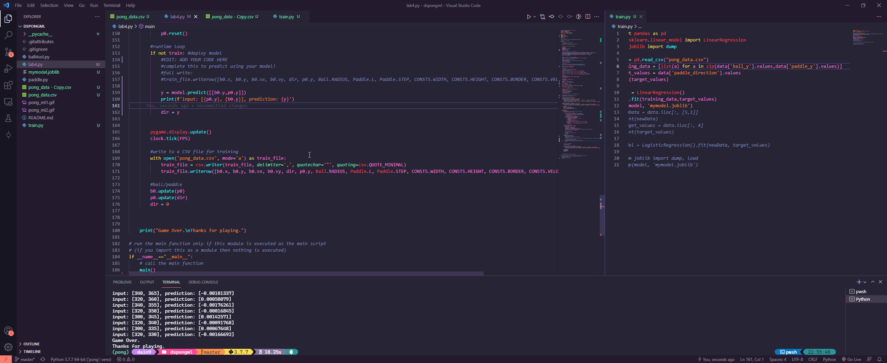

# Pong Lab: ML Player

## Introduction
Simple linear regression model that learns to play Pong.

Our linear regression model uses the ball's y-coordinate and the paddle's y-coordinate as input parameters, and the paddle's moving direction is the predicted output of the model.

## Example
Below is a gif of the model in action:

## Contributors
- Chris D'Entremont
- Gabriel Madeira
- Dain Im
